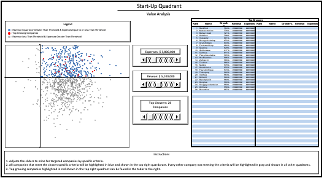

# StartUp_Analysis

## Project Description

The analysis seeks to explore specific questions on data regarding start-up companies.

## Methods Used

1) Data exploration, cleaning, and descriptive statistical analysis.

## Results 

### Which are the top 10 industries basis Revenue? 

**Top 10 industries basis average revenue per company**:

* Media  - $10M
* Retail - $10M
* Security - $10M
* Government Services - $9M
* Environmental Services - $9M
* Logistics & Transportation - $9M
* Engineering - $9M
* Real Estate - $9M
* IT Services - $9M
* Consumer Products & Services - $9M

**Top 10 industries basis total revenue**:

* IT Services - $1,345M
* Software - $775M
* Health - $774M
* Business Products & Services - $596M
* Advertising & Marketing - $594M
* Government Services - $472M
* Financial Services - $468M
* Retail - $463M
* Construction - $437M
* Consumer Products & Services - $412M

### Which company had the maximum change in profit from 2014 to 2015?

**Greatest profit change to the upside from 2014 - 2015**:

* Foxwml - 4,120%

**Greatest change to the downside from 2014 - 2015**:

* Grippingstirring - 10,629%

### Identify the companies that fulfill these 3 criterias (Consider 2015 numbers)
**a) They should be among the top 100 in terms of revenue** 
**b) They should be among the top 100 in terms of expenses** 
**c) They should be among the top 100 in terms of growth percentage** 

* Hot-Electrics - **2015 Rev:** $12,214M, **2015 Exp:** $1,412M, **2015 Growth:** 595%
* Shadefronted - **2015 Rev:** $12,242M, **2015 Exp:** $1,382M, **2015 Growth:** 537% 

### Dashboard 

## Technologies 

1) MySQL
2) MySQL Workbench
3) Microsoft Excel

## Directory Files

1) **StartUp_Analysis.sql** - Analysis in MySQL.
2) **Stored_Procedures.sql** - Project stored procedures. 
3) **StartUp_Analysis_Dashboard.xlsx** - Dashboard in Microsoft Excel.
